# Salesforce Recruitment Management System

A Salesforce-based recruitment management system for managing companies, job positions, candidates, applications, interviews, and recruitment automation.

## Overview

This project implements a complete recruitment workflow using Salesforce standard and custom objects, lookup relationships, validation rules, record-triggered flows, email automation, reports, and dashboards.

## Key Features

- Company and job position management
- Candidate profile management
- Application tracking
- Interview scheduling and tracking
- Automatic candidate placement status update
- Automated interview email notification
- Recruitment data validation
- Reports and dashboard for recruitment monitoring

## Data Model

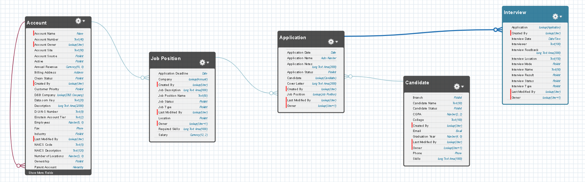

Account (Company) is linked to Job Position, which is linked to Application; Application is also linked to Candidate, and Interview is linked to Application.

The data model connects companies, job positions, applications, candidates, and interviews into a structured recruitment workflow.

## Lightning Application

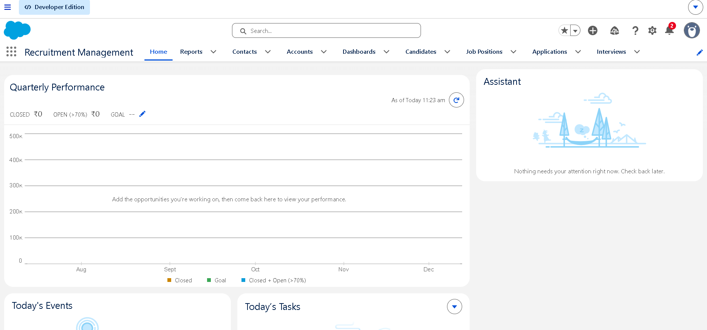

The custom Lightning application provides centralized navigation for managing the recruitment process.

## Candidate Management

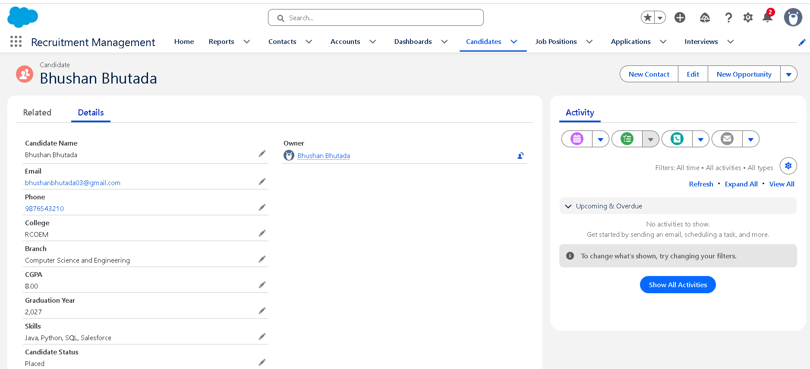

Candidate records contain contact details, college, branch, CGPA, graduation year, skills, and recruitment status.

## Job Position Management

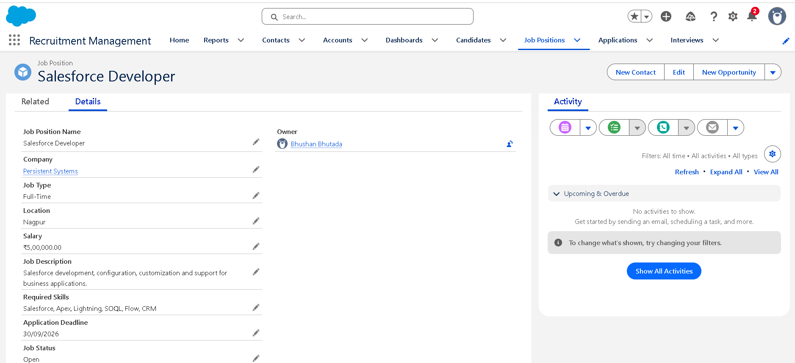

Job positions contain company, job type, location, salary, required skills, application deadline, and job status.

## Application Management

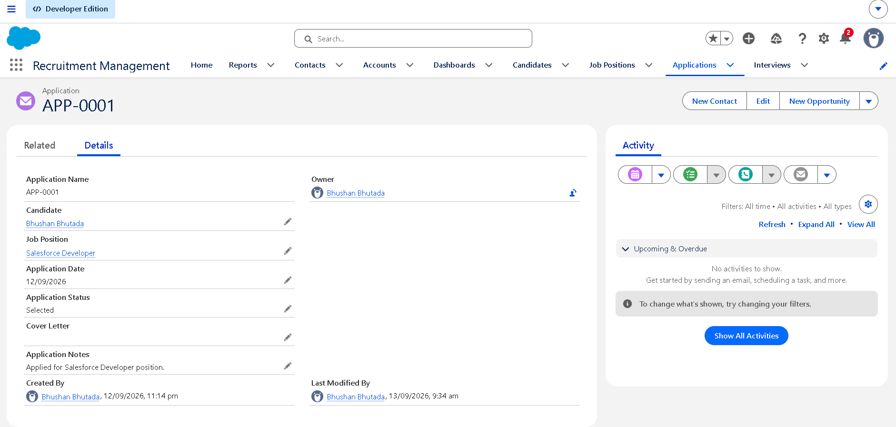

Applications connect candidates with job positions and track their recruitment status from application to selection or rejection.

## Interview and Email Automation

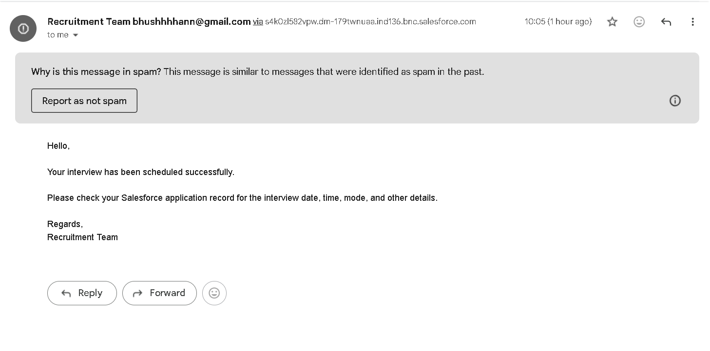

A record-triggered Flow sends an email notification when an interview is scheduled.

## Recruitment Automation

The system uses two record-triggered Flows to automate key recruitment steps:

Candidate Placement Flow
- Trigger Object: Application
- Entry Condition: Application Status = Selected
- Action: Updates the related Candidate record so that Candidate Status = Placed

Interview Notification Flow
- Trigger Object: Interview
- Entry Condition: Interview Status = Scheduled
- Action: Sends an email notification to the Candidate's email address

Both automations were tested successfully through the complete application workflow.

## Validation Rules

The system uses Salesforce Validation Rules to prevent invalid recruitment data.

### CGPA and Graduation Year

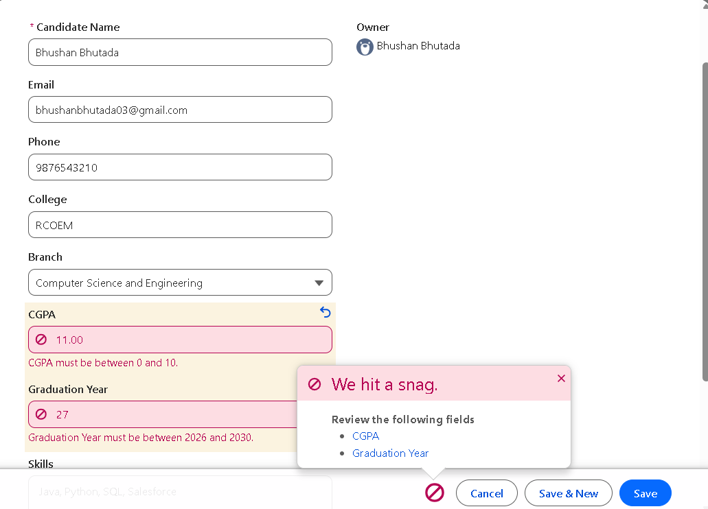

Candidate CGPA and graduation year are validated before the record can be saved.

### Job Status and Application Deadline

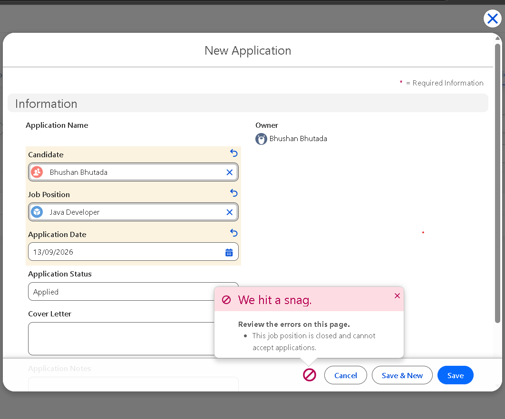

Applications are prevented when the associated job is closed or its application deadline has passed.

### Interview Date

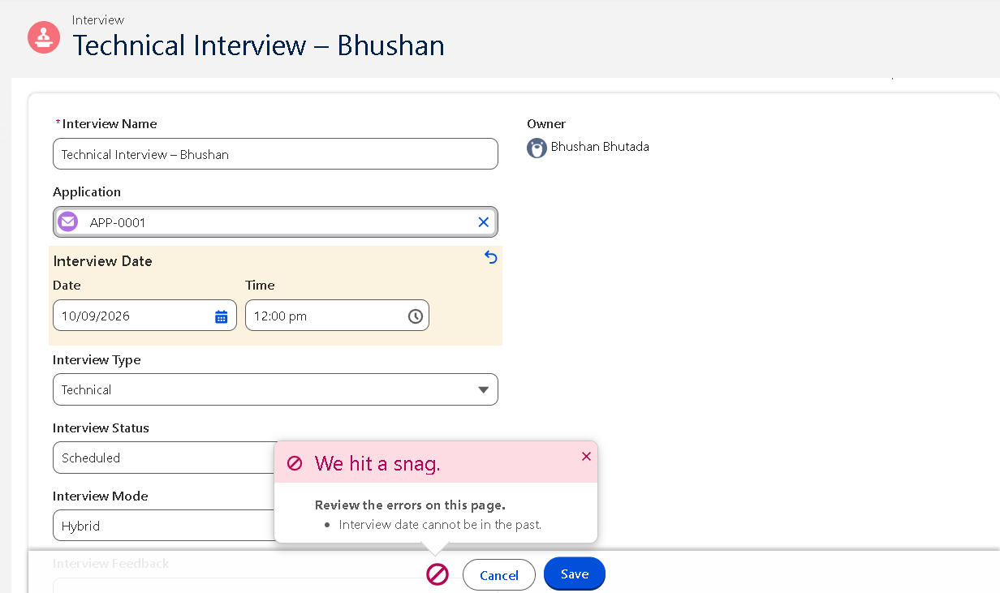

Interview dates cannot be set in the past.

## Reports

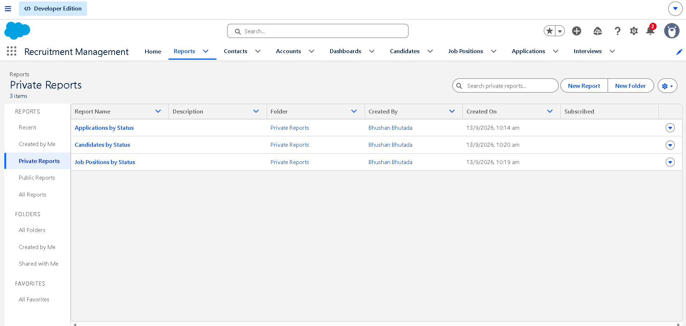

Reports provide recruitment summaries for applications, candidates, and job positions based on their current statuses.

## Dashboard

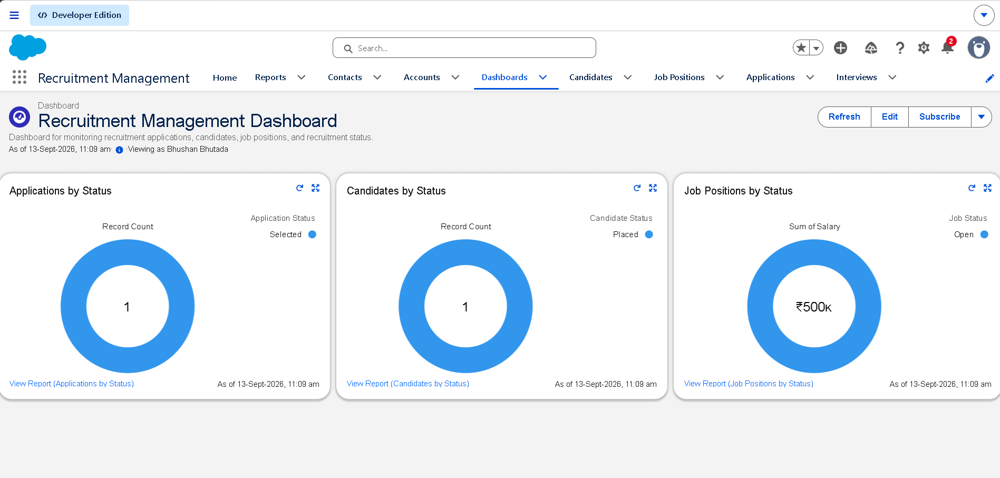

The dashboard provides a visual overview of applications, candidates, and job positions.

## End-to-End Testing

| Test Case | Result |
|---|---|
| Valid candidate creation | Passed |
| Invalid CGPA | Validation triggered |
| Invalid graduation year | Validation triggered |
| Application for closed job | Validation triggered |
| Application after deadline | Validation triggered |
| Past interview date | Validation triggered |
| Shortlisted application | Candidate remains Active |
| Selected application | Candidate becomes Placed |
| Scheduled interview | Email notification triggered |
| Reports | Verified |
| Dashboard | Verified |

## Salesforce Concepts Used

- Lightning Experience
- Standard and Custom Objects
- Custom Fields
- Lookup Relationships
- Picklists
- Page Layouts
- Validation Rules
- Record-Triggered Flows
- Email Automation
- Salesforce Files
- Reports
- Dashboards
- Object Permissions
- Sharing Settings

## Technology

**Platform:** Salesforce

**Features:** Lightning Experience, Custom Objects, Validation Rules, Record-Triggered Flows, Email Automation, Reports, Dashboards

## Review

This project was developed and tested in a Salesforce Trailhead Playground. The repository contains screenshots documenting the configured objects and relationships, the automation flows, validation rules, reports, dashboard, and the end-to-end testing carried out on the system.

## Future Enhancements

- Resume and document management
- Automated interview reminders
- Recruiter-specific access controls
- Advanced candidate filtering
- Additional recruitment analytics

## Author

**Bhushan Bhutada**

Computer Science and Engineering Student

[GitHub](https://github.com/bhushanbhutada03) | [LinkedIn](https://www.linkedin.com/in/bhushanbhutada03/)
